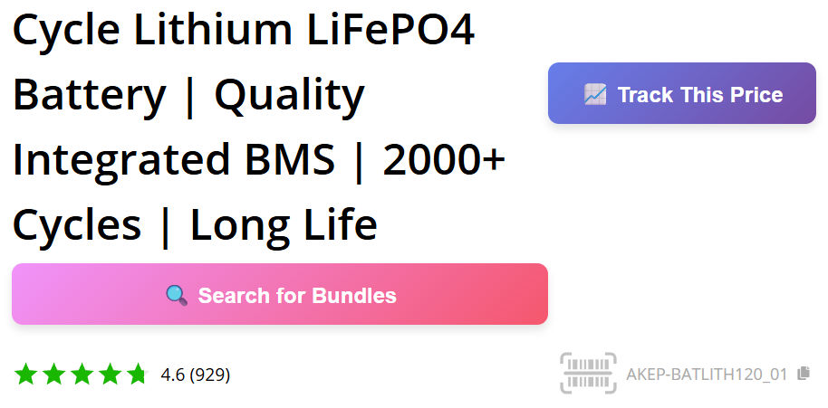
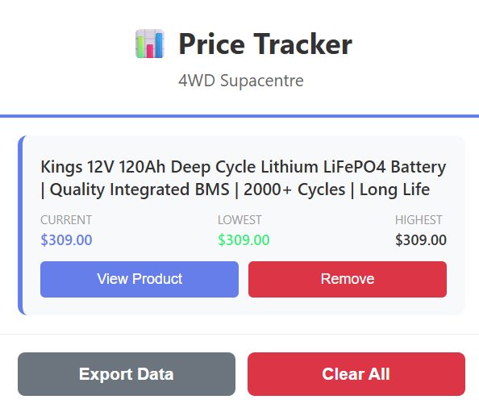

# 4WD Supacentre Price Tracker

A Chrome/Edge browser extension that tracks historical prices for products on 4WD Supacentre, helping you know when to buy.


## 🎯 Why This Exists

4WD Supacentre has frequent sales and price changes. This extension helps you:
- Track price history for products you're watching
- See if the current price is the lowest it's been
- Avoid impulse buying when prices aren't actually good deals

## ✨ Features

- **One-Click Tracking**: Track any product with a single button click
- **Price History**: See current, lowest, and highest prices at a glance
- **Local Storage**: All data stored locally on your browser - no cloud, no tracking
- **Export Data**: Download your price history as JSON to back up or share
- **Clean UI**: Simple popup showing all tracked products

## 📸 Screenshots

*Track button appears on product pages:*
```
[Track This Price] button appears above Add to Cart

```

*Popup shows all tracked products:*
```
Current: $629  |  Lowest: $629  |  Highest: $629
```

## 🚀 Installation

### Load Unpacked Extension (Development)

1. Download or clone this repository
2. Open Chrome/Edge and navigate to `chrome://extensions/`
3. Enable "Developer mode" (toggle in top right)
4. Click "Load unpacked"
5. Select the `4wd-price-tracker` folder
6. The extension is now installed!

### Usage

1. Visit any product page on https://www.4wdsupacentre.com.au/
2. Click the "📈 Track This Price" button (appears below Add to Cart)
3. Price is now being tracked - button changes to "📊 Tracking Price"
4. Click the extension icon to see all tracked products
5. Click "View Product" to open the product page
6. Click "Remove" to stop tracking a product


## 🛠️ How It Works

### Price Detection
The extension identifies prices by looking for the specific HTML structure 4WD Supacentre uses:
```html
<div class="calcFreightTotal-*">
  <span class="integerOriginal-*">629</span>
</div>
```

### Data Storage
All data is stored locally using Chrome's `storage.local` API:
```json
{
  "trackedProducts": {
    "https://www.4wdsupacentre.com.au/product-url.html": {
      "title": "Product Name",
      "sku": "SKU123",
      "priceHistory": [
        {
          "price": 629.00,
          "timestamp": 1767403585659
        }
      ]
    }
  }
}
```

### When Prices Update
- **Current behavior**: Price is updated each time you visit the product page
- If the price has changed since last visit, a new entry is added to history
- If price is the same, no duplicate entry is created

## 📊 Data Structure

Each tracked product contains:
- **URL**: Unique identifier for the product
- **Title**: Product name
- **SKU**: Product code (if available)
- **Price History**: Array of `{price, timestamp}` objects

## 🔒 Privacy

- ✅ All data stored locally on your computer
- ✅ No data sent to external servers
- ✅ No tracking or analytics
- ✅ No personal information collected
- ✅ Works entirely offline (after installation)

The only network requests are to 4WD Supacentre when you visit product pages (normal browsing).

## 📁 Project Structure

```
4wd-price-tracker/
├── manifest.json       # Extension configuration
├── content.js          # Runs on product pages, detects prices
├── content.css         # Styling for injected elements
├── popup.html          # Extension popup UI
├── popup.js            # Popup functionality
├── popup.css           # Popup styling
├── icons/              # Extension icons
│   ├── icon16.png
│   ├── icon48.png
│   └── icon128.png
└── README.md           # This file
```

## 🔧 Technical Details

- **Manifest Version**: 3
- **Permissions**: `storage`, `tabs`
- **Host Permissions**: `https://www.4wdsupacentre.com.au/*`
- **Content Script**: Injected on all 4WD Supacentre pages
- **Popup**: 400x600px max

## 🚧 Known Limitations

- Only tracks prices when you visit the product page (no background checking yet)
- Only works on 4WD Supacentre website
- Price history starts from when you first track a product
- Data is local to your browser (not synced across devices)

## 🔮 Roadmap (Phase 2)

Potential future features:
- [ ] Background price checking (daily auto-updates)
- [ ] Price drop notifications
- [ ] Price history charts
- [ ] Export/import data for sharing
- [ ] Target price alerts ("notify me when below $X")

## 🤝 Contributing

This is a personal project, but contributions are welcome!

1. Fork the repository
2. Create a feature branch (`git checkout -b feature/amazing-feature`)
3. Commit your changes (`git commit -m 'Add amazing feature'`)
4. Push to the branch (`git push origin feature/amazing-feature`)
5. Open a Pull Request

## 📝 License

MIT License - Do whatever you want with this!

## ⚠️ Disclaimer

This extension is not affiliated with 4WD Supacentre. It's a personal tool for tracking prices.

Price data accuracy depends on correct HTML structure on 4WD Supacentre's website. If they change their website structure, the extension may need updates.

## 🐛 Troubleshooting

**Button not appearing?**
- Refresh the page
- Check you're on a product page (not category/homepage)
- Open DevTools console (F12) and look for `[Price Tracker]` messages

**Prices not updating?**
- Prices only update when you visit the page
- Check the console for errors
- Try removing and re-tracking the product

**Data disappeared?**
- Check if you cleared browser data
- Data is stored in `chrome.storage.local`
- Use Export Data regularly to back up

**Wrong price being tracked?**
- Check the console to see what price was detected
- Report an issue with the product URL

## 📧 Support

Found a bug or have a feature request? Open an issue on GitHub!

## 🙏 Acknowledgments

Built to scratch my own itch - I needed to know when to pull the trigger on a 4WD fridge purchase!

---

**Happy price tracking!** 🎯
